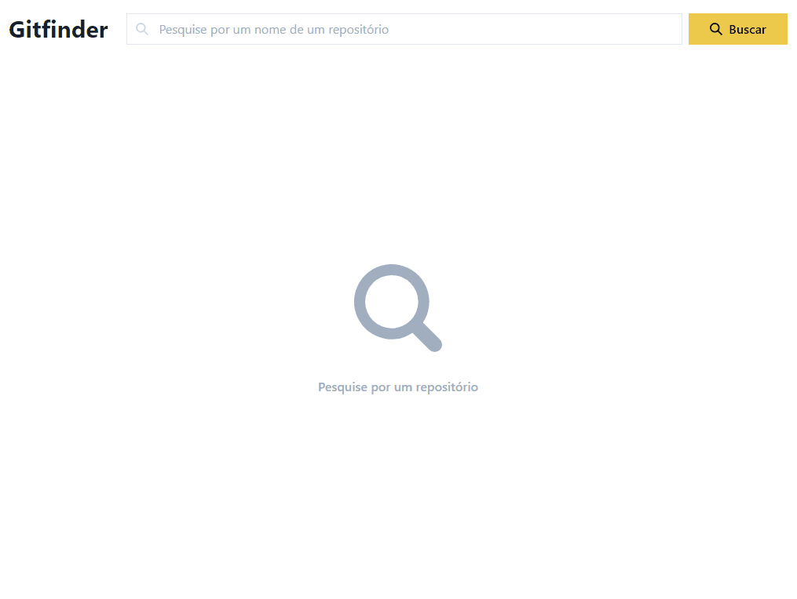

<h1 align="center">
  Gitfinder
</h1>

Este projeto consiste em ser um buscador de repositórios do Github

## 👽 Tecnologias

- ReactJS
- ViteJS
- ChakraUI
- Axios
- React Query
- Masonic

## 🌍 Acesso

O projeto pode ser acessado por [este link](https://the-gitfinder.netlify.app)

## ⚙ Funcionalidades

- Pesquisar repositórios:
  
- Selecionar pesquisa recente:
  
- Remover uma sugestão recente:
  
- Pesquisar um repositório inexistente
  

## 📋 Licença

Você pode ver mais detalhes sobre a licença clicando [aqui](LICENSE).
